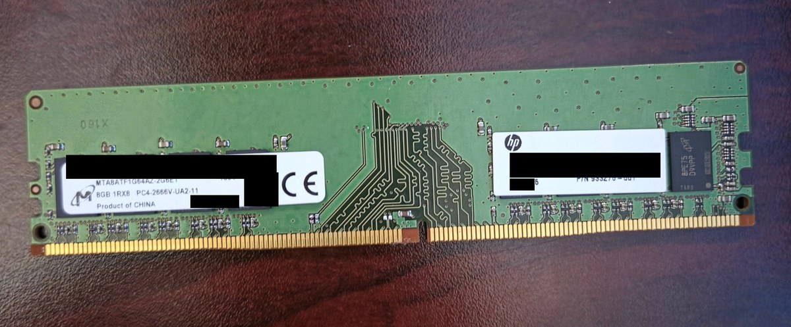

# Lab 00: Hardware Troubleshooting (HP EliteDesk 705 G4 No-POST)

## Goal

Diagnose and repair an HP EliteDesk 705 G4 SFF that powered on but showed nothing on screen, so it could be reused as a homelab server.

## Environment

| Item | Details |
|------|---------|
| Machine | HP EliteDesk 705 G4 SFF (AMD) |
| Original RAM | 1 x 8GB DDR4-2666 (PC4-2666V-UA2, 1Rx8, unbuffered, non-ECC) |
| Storage | M.2 NVMe SSD, no operating system installed |
| Display | Monitor connected to onboard DisplayPort |

## Symptoms

- The machine powered on, but the monitor showed no signal.
- Two beeps at power-on with the original RAM in some slots.
- A different pattern in other slots: 3 red blinks, then 2 white blinks; each blink was followed by a beep on the power LED.

## Diagnosis process

### 1. Basic checks
- Unplugged the power and held the power button for about 15 seconds to drain residual power.
- Opened the side panel and pivoted the drive cage up to reach the memory slots.
- Cleaned the RAM copper connection to ensure proper seating and contact.
- Reseated the RAM. At first the retaining clips would not lock, so I opened the clips fully, checked that the module notch lined up with the slot, and applied firm, even pressure until they clicked.

Result: still two beeps.

### 2. Slot testing
The board has four DIMM slots and I had one stick, so I tested it in each slot:

| Slot | Result |
|------|--------|
| 1 | Two beeps |
| 2 | 3 red, 2 white LED blinks |
| 3 | Two beeps |
| 4 | 3 red, 2 white LED blinks |

The behavior followed the memory channel pairs (1 and 3, 2 and 4) and was the same across all four slots, which pointed at the module and not at one bad slot.

### 3. Decoding the LED pattern
HP business desktops report faults through power LED blinks: the red blinks give the category and the white blinks give the specific fault. Three red followed by two white is listed by HP as a memory error that occurs before video initializes. That also explained the blank screen, since the machine failed before it ever tried to display anything.

### 4. Ruling out a compatibility problem

  

I read the label on the stick (`PC4-2666V-UA2-11`):
- **PC4**: DDR4
- **2666V**: DDR4-2666, supported by this machine
- **U**: unbuffered, non-ECC, full-size DIMM

The module was the correct type, so the likely cause was a failed module.

### 5. Replacement test
I bought a new Kingston 16GB DDR4 DIMM from a reputable brand and installed it alone in slot 1, after a full power drain.

Results:
- The memory error codes stopped.
- One short beep, then a solid white power LED and quiet fans, which indicated a normal start.
- The monitor was still blank, so I checked the display path by reseating the DisplayPort cable and trying different cables and ports.
- The HP Startup Menu then appeared on screen after I plugged the computer into a separate display.

After setting up the machine, I was able to move the DisplayPort back to the first monitor and it worked.

### 6. Verification
- **System Information (F1):** reported the full 16GB.
- **System Diagnostics (F2) memory test:** passed.
- **BIOS:** confirmed that AMD virtualization (SVM Mode) was already enabled and USB boot was allowed, which the next lab needs.

## Resolution

The original RAM module was almost certainly faulty. It failed in all four slots, and the replacement worked immediately in slot 1. I did not test the original stick in a second known-good machine, so I list it as presumed bad, not proven bad. The system now passes its memory test and is ready for an operating system.

## What I learned

- Beep codes and LED blink codes differ by manufacturer, so I confirmed meanings in HP's documentation and did not assume them.
- Isolating one variable at a time (slot, stick, cable) turned a vague "it won't boot" into a specific fault.
- Testing the same module in every slot helps separate a bad module from a bad slot.
- Reading the memory label (PC4, speed, U/E/R) is the fastest way to rule out a compatibility problem.
- A new part can arrive different from the listing, so I checked what was installed with System Information and a memory test before trusting it.
- Documenting results as I went made the next steps easy to plan.

## Tools and skills used

- HP power LED diagnostic codes
- DIMM reseating and slot-by-slot isolation testing
- BIOS and Startup Menu navigation (F1, F2, F10)
- HP System Diagnostics memory test
- Display troubleshooting (cables, ports, monitor inputs)
